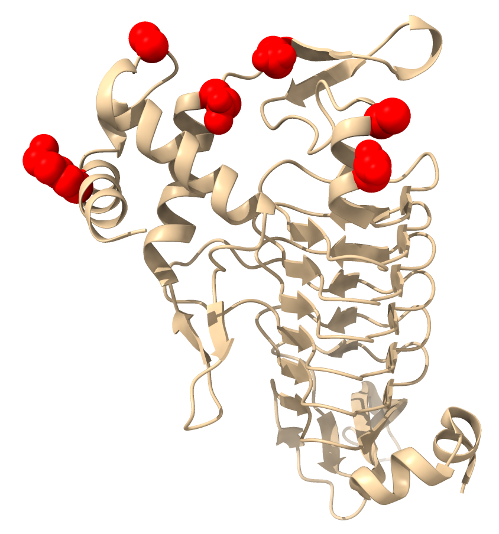
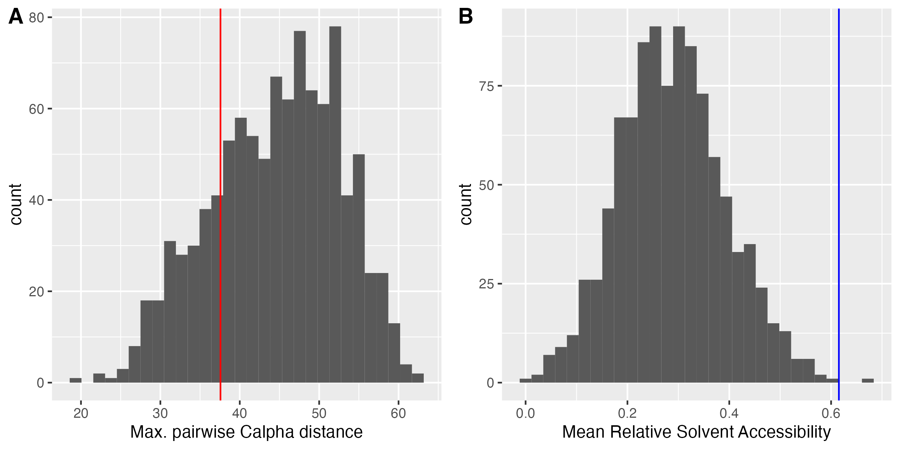
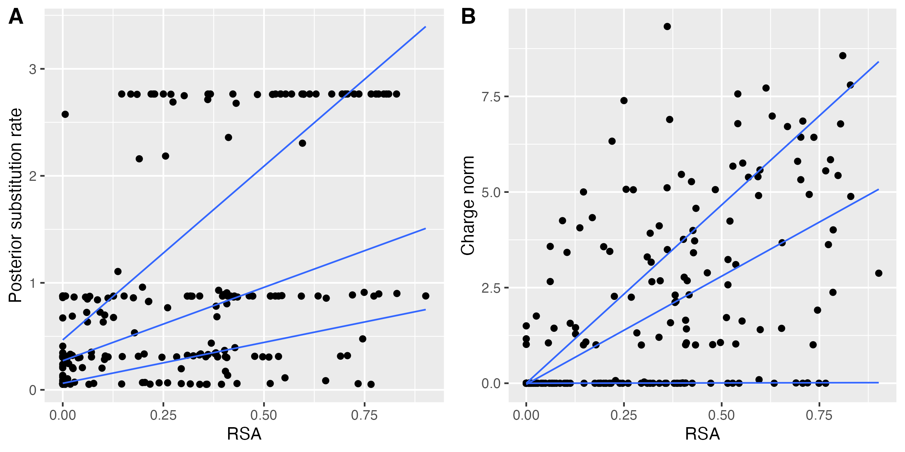
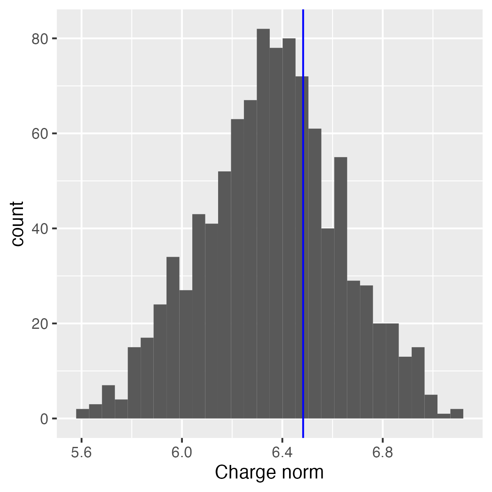

Analyse the coevolving groups from family HOG000003295. This example data set is taken from [Chaurasia and Dutheil, 2022][[1]].

## Create a structure index

To map residues on a structure, we obviously need at least one structure.
This family is associated with three PDB entry, which we can download and map to our alignment to find the best match.

```bash
python3 ../../src/sged-create-structure-index.py \
         --pdb-id 3BXY \
         --pdb-id 3EG4 \
         --pdb-id 3GOS \
         --pdb-format remote:mmCif \
         --alignment ../data/HOG000003295_bppalnscore.mase \
         --alignment-format ig \
         --output HOG000003295_PdbIndex.txt
```

The best alignment involves seq71 and chain A from entry 3EG4, which will be used for creating the index.


## Get the PDB coordinates of the detected coevolving groups

Get significant groups only (requires csvkit):

```bash
csvgrep -t -c FDR -m yes ../data/HOG000003295_charge_stats_pvalues.csv | csvformat -T > HOG000003295_charge_significant.sged
```

There is one significant group of six sites.
We translate its coordinates using the previously generated index:

```bash
python3 ../../src/sged-translate-coords.py \
         --sged HOG000003295_charge_significant.sged \
         --index HOG000003295_PdbIndex.txt \
         --output HOG000003295_charge_significant_PDB.sged \
         --name PDB
```

We can then visualize the results, for instance using the [https://www.rbvi.ucsf.edu/chimerax/](ChimeraX) program:

```
name group /A:15,102,106,26,75,78
hide all
ribbon /A
show group
color group red
```

The coevolving residues are shown in red:



We now would like to ask:

- Are the residues more close to each other than expected by chance?
- Are the residues more close to the surface of the protein than expected by chance?

To answer these questions, we need to know what is the random expectation, that is, what is the distribution of some statistics for any group of 6 random sites in this protein.

## Compute structural statistics of the coevolving group

Compute 3D distances, RSA, and secondary structures:

```bash
python3 ../../src/sged-structure-infos.py \
         --sged HOG000003295_charge_significant_PDB.sged \
         --group PDB \
         --pdb 3eg4.cif \
         --pdb-format mmCif \
         --measures AlphaDist,DSSPsum,SecondaryStructureLabel \
         --output HOG000003295_charge_significant_PDB_infos.sged
```

This gives us several structural statistics. For instance, the maximum 3D distances between the Calpha of any pair within the 6 coevolving residues is 37.6°A, and the mean of their relative solvent accessibility is 61.5%.

## Get random groups

To sample random groups, we first need to get the list of sites that were analysed, which is given in file `HOG000003295_charge_siteInfos.csv`.
We then generate 1000 replicates using the `sged-randomize-groups.py` script:

```bash
python3 ../../src/sged-randomize-groups.py \
         --sged-groups HOG000003295_charge_significant.sged \
         --sged-sites ../data/HOG000003295_charge_siteInfos.csv \
         --number-replicates 1000 \
         --output HOG000003295_charge_random.sged
```

We then need to map these groups on the 3D structure, like we did for the observed group:

```bash
python3 ../../src/sged-translate-coords.py \
         --sged HOG000003295_charge_random.sged \
         --index HOG000003295_PdbIndex.txt \
         --output HOG000003295_charge_random_PDB.sged \
         --name PDB
```

And compute the structural statistics (we ommit the secondary structure label, which we do not use):

```bash
python3 ../../src/sged-structure-infos.py \
         --sged HOG000003295_charge_random_PDB.sged \
         --group PDB \
         --pdb 3eg4.cif \
         --pdb-format mmCif \
         --measures AlphaDist,DSSPsum \
         --output HOG000003295_charge_random_PDB_infos.sged
```

We can now visualize the results in R:

```r
sims <- read.table("HOG000003295_charge_random_PDB_infos.sged", header = TRUE)
obs <- read.table("HOG000003295_charge_significant_PDB_infos.sged", header = TRUE)

require(ggplot2)
require(ggpubr)
h1 <- ggplot(sims, aes(x = AlphaDistMax)) + geom_histogram(bins = 30) +
      geom_vline(xintercept = obs$AlphaDistMax, col = "red") +
      xlab("Max. pairwise Calpha distance")
h2 <- ggplot(sims, aes(x = RsaMean)) + geom_histogram(bins = 30) +
      geom_vline(xintercept = obs$RsaMean, col = "blue") +
      xlab("Mean Relative Solvent Accessibility")
p <- ggarrange(h1, h2, labels = c("A", "B"))
ggsave(p, filename = "Randomization1.png", width = 8, height = 4)
```



The maximal pairwise distance of the group is not significantly shorter than expected by chance, but the residues are more exposed to the surface than similar random residues.


## Condition on evolutinary rates

In the previous section, sites were sampled randomly, independently of their properties.
Sites, however, evolve at different rates; the rate of the site potentially acting as a confounding factors. For instance, residues at the surface of proteins tend to evolve faster, and fast-evlving residues may have a higher propensity to coevolve. We can test/verify these points.

First, we can verify the correlation rate/RSA with our candidate proteins. For this, we map all analised positions in the alignment on the protein, still using the structural index we created before:

```bash
python3 ../../src/sged-translate-coords.py \
         --sged ../data/HOG000003295_charge_siteInfos.csv \
         --index HOG000003295_PdbIndex.txt \
         --output HOG000003295_charge_siteInfos_PDB.sged \
         --name PDB
```

and then compute structural properties:

```bash
python3 ../../src/sged-structure-infos.py \
         --sged HOG000003295_charge_siteInfos_PDB.sged \
         --group PDB \
         --pdb 3eg4.cif \
         --pdb-format mmCif \
         --measures DSSP \
         --output HOG000003295_charge_siteInfos_PDB_infos.sged
```

We have two measures of evolutionary rate in the original site file: the posterior estimate of the total substitution rate, computed using the classical empirical Bayesian approach, and the norm of the substitution vector N, which here accounts for substitutions that change the charge of the residue only (that is, a measure of "charge" evolution). We plot both a a function of RSA:

```r
dat <- read.table("HOG000003295_charge_siteInfos_PDB_infos.sged", header = TRUE)
require(ggplot2)
require(ggpubr)
p.pr <- ggplot(dat, aes(x = Rsa, y = PR)) + 
        geom_point() + geom_quantile() +
        xlab("RSA") + ylab("Posterior substitution rate")
p.N  <- ggplot(dat, aes(x = Rsa, y = N)) + 
        geom_point() + geom_quantile() +
        xlab("RSA") + ylab("Charge norm")
p <- ggarrange(p.pr, p.N, labels = c("A", "B"))
ggsave(p, filename = "RsaRateCorrelations.png", width = 8, height = 4)

cor.test(~Rsa+PR, dat, method = "kendall")
cor.test(~Rsa+N, dat, method = "kendall")
```



The signal is not very strong (only one protein is considered here) but significant in both cases (Kendall's tau = 0.36, P value - 5.776e-15 and tau = 0.44, P value = 2.2e-16, for the posterior rate and norm, respectively).

```bash
python3 ../../src/sged-summary.py \
         --sged-groups HOG000003295_charge_significant.sged \
         --sged-sites HOG000003295_charge_siteInfos_PDB_infos.sged \
         --property PR \
         --name meanPR \
         --property N \
         --name meanN \
         --property Rsa \
         --name meanRsa \
         --function mean \
         --output HOG000003295_charge_significant_summary.sged

```

Note: we find the same average RSA value as before, when applying `sged-structure-infos` on the candidate group.

Now we compute the average rate for the sampled groups:

```bash
python3 ../../src/sged-summary.py \
         --sged-groups HOG000003295_charge_random.sged \
         --sged-sites HOG000003295_charge_siteInfos_PDB_infos.sged \
         --property PR \
         --name meanPR \
         --property N \
         --name meanN \
         --function mean \
         --output HOG000003295_charge_random_summary.sged
```

```r
sims <- read.table("HOG000003295_charge_random_summary.sged", header = TRUE)
obs <- read.table("HOG000003295_charge_significant_summary.sged", header = TRUE)

require(ggplot2)
require(ggpubr)
h1 <- ggplot(sims, aes(x = meanPR)) + geom_histogram(bins = 30) +
      geom_vline(xintercept = obs$meanPR, col = "red") +
      xlab("Posterior substitution rate")
h2 <- ggplot(sims, aes(x = meanN)) + geom_histogram(bins = 30) +
      geom_vline(xintercept = obs$meanN, col = "blue") +
      xlab("Charge norm")
p <- ggarrange(h1, h2, labels = c("A", "B"))
ggsave(p, filename = "Randomization1_rates.png", width = 8, height = 4)
```


The candidate group evolves faster than randomly selected groups of the same size.
We need to correct for the evolutionary rate when assessing whether coevolving residues are more exposed than expected by chance!
We condition the sampling on sites with similar charge norms (that is, sites that, individually, have similar numbers of substitutions that change the charge of the residue).

```bash
python3 ../../src/sged-randomize-groups.py \
         --sged-groups HOG000003295_charge_significant.sged \
         --sged-sites ../data/HOG000003295_charge_siteInfos.csv \
         --measure N \
         --number-replicates 1000 \
         --similarity-threshold 0.2 \
         --output HOG000003295_charge_random2.sged
```

We check that the correction worked:

```bash
python3 ../../src/sged-summary.py \
         --sged-groups HOG000003295_charge_random2.sged \
         --sged-sites HOG000003295_charge_siteInfos_PDB_infos.sged \
         --property PR \
         --name meanPR \
         --property N \
         --name meanN \
         --function mean \
         --output HOG000003295_charge_random2_summary.sged
```

```r
sims <- read.table("HOG000003295_charge_random2_summary.sged", header = TRUE)
obs <- read.table("HOG000003295_charge_significant_summary.sged", header = TRUE)

require(ggplot2)
require(ggpubr)
p <- ggplot(sims, aes(x = meanN)) + geom_histogram(bins = 30) +
      geom_vline(xintercept = obs$meanN, col = "blue") +
      xlab("Charge norm")
ggsave(p, filename = "Randomization2_norm.png", width = 4, height = 4)
```



Finally, we check if RSA is still significant. As before, we map these groups on the 3D structure:

```bash
python3 ../../src/sged-translate-coords.py \
         --sged HOG000003295_charge_random2.sged \
         --index HOG000003295_PdbIndex.txt \
         --output HOG000003295_charge_random2_PDB.sged \
         --name PDB
```

Then, we compute the structural statistics:

```bash
python3 ../../src/sged-structure-infos.py \
         --sged HOG000003295_charge_random2_PDB.sged \
         --group PDB \
         --pdb 3eg4.cif \
         --pdb-format mmCif \
         --measures AlphaDist,DSSPsum \
         --output HOG000003295_charge_random2_PDB_infos.sged
```

We can now visualize the results in R:

```r
sims <- read.table("HOG000003295_charge_random2_PDB_infos.sged", header = TRUE)
obs <- read.table("HOG000003295_charge_significant_PDB_infos.sged", header = TRUE)

require(ggplot2)
require(ggpubr)
h1 <- ggplot(sims, aes(x = AlphaDistMax)) + geom_histogram(bins = 30) +
      geom_vline(xintercept = obs$AlphaDistMax, col = "red") +
      xlab("Max. pairwise Calpha distance")
h2 <- ggplot(sims, aes(x = RsaMean)) + geom_histogram(bins = 30) +
      geom_vline(xintercept = obs$RsaMean, col = "blue") +
      xlab("Mean Relative Solvent Accessibility")
p <- ggarrange(h1, h2, labels = c("A", "B"))
ggsave(p, filename = "Randomization2.png", width = 8, height = 4)
```


The results are no longer significant. The proximity and exposure of the coevolving sites may be a by-product of their fast evolutionary rate.

[1]: Chaurasia S and Dutheil JY. The Structural Determinants of Intra-Protein Compensatory Substitutions 
Molecular Biology and Evolution, 39(4): msac063, [https://doi.org/10.1093/molbev/msac063](https://doi.org/10.1093/molbev/msac063).


